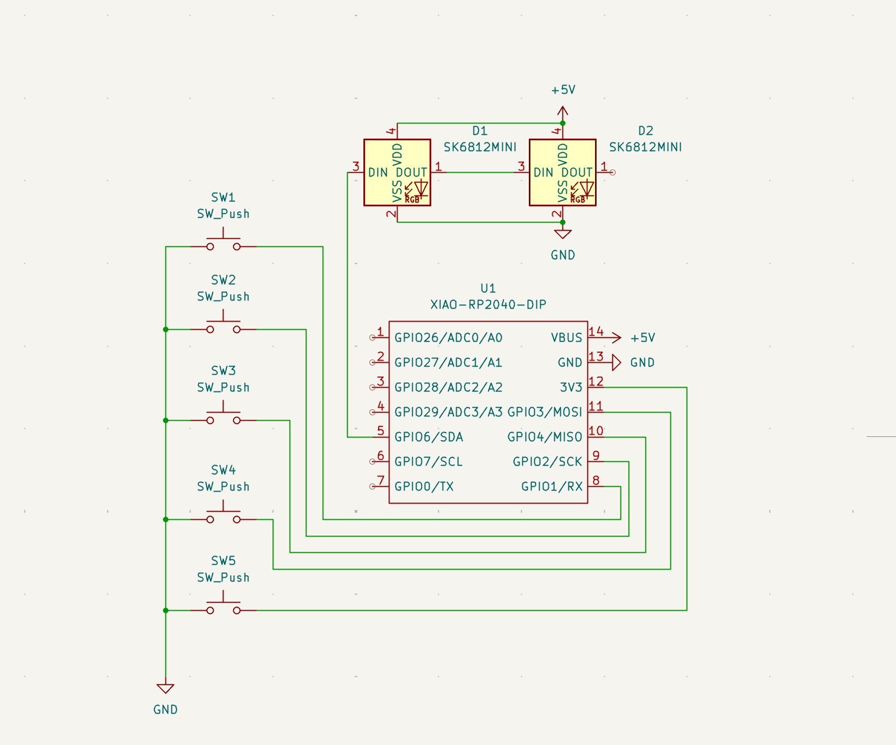
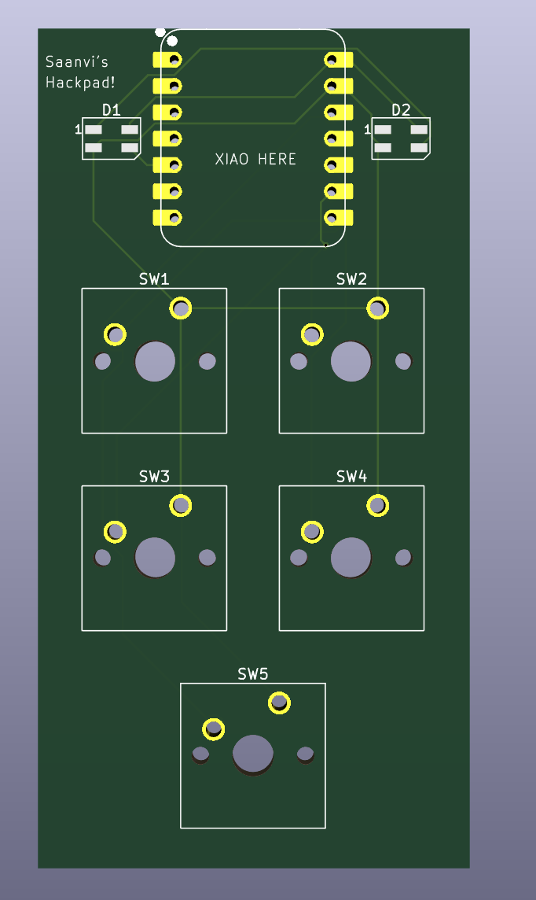

# Hackpad
My personal macropad!

# inspiration 
I completed this for Hackclubs Blueprint event as I wanted to learn more hardware skills like pcb design

# Challenges
this was my second time using kicad, but it was the first time making something slightly more complex. The real challenge was Fusion360 because some of the controls seemed wrong and I really had to experment with the buttons and order that I clicked them in to get my sedired result. Once I got the hang of it tho it got significantly easier.

### Specifications

BOM: 
- 5x Cherry MX Switches
- 2x SK6812 MINI Leds
- 1x XIAO RP2040
- 5x Blank DSA Keycaps
- 4x M3x16 Bolt
- 4x M3 Heatset
